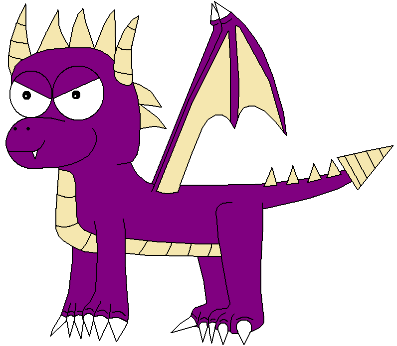

# Project managing a migration project: tips and tricks

<a href="https://github.com/kafeiinteractiff"><i class="fa fa-twitter"></i></a>
<a href="https://twitter.com/kafeiinteractif"><i class="fa fa-github"></i></a>
<a href="https://www.drupal.org/kafei-interactih1-inc"><i class="fa fa-drupal"></i></a>

Presented by Ryan Weal, collaboration with Novella Chiechi

San José, Costa Rica 2016-09-01 ... Slides: http://bit.ly/2bGc1oi

<!-- Section: Decisions, Decisions -->
# Determining migration strategy

## Making decisions about content

 - Sources: what data to import?
 - Process: transform / clean-up the data?
 - Destinations: where will it go?

In this scenario you will have a new site you build, and you will "pull"
content into it from the sources. You can import many sources into one site.

## We already use Drupal.
## Is now the time?

 - Drupal 6 - yes! Move!
    - Jump directly from D6->D8.
    - You need to move. Support ended on February 24, 2016. It is possible to contract long-term support, but recommended to migrate.

 - Drupal 7 - you have some time... relax!
    - Best for your longer-term or self-funded projects. File bugs for the migration system and wait. Or fix it. ;)

 - Other platforms? YEAH! Do it now... and post your code to drupal.org (do not have access? ask me)

## What tool? Should we use migrate module?
### Some other options:
 - Cut and paste
 - Feeds (is it ready, is it a manual process?)
 - Script to login and create nodes

*Too much work!*

## Reasons to use Migrate module

The simplest migration is just field mappings in a YML file. Drupal 6 & 7 migrations do this part automatically if you want.

 - Ability to rollback and re-import,
 - Opportunity to re-architect things,
 - Easy to override.
 - Stored in code, no steps to remember.

 Client decides to pause project for ~3 months? ...so what. Just run the code.

## What can I migrate?
You can migrate <em>ANYTHING</em> into Drupal 8.

### Pre-built sources:
 - Drupal 6 + CCK + i18n
 - Drupal 7 + i18n
 - Wordpress

### Generic sources:
 - CSV files (even single-column lists)
 - XML
 - JSON

...and it is easy to make your own source. Just copy one of the above plugins
you like into your custom module and change the name.

# Creating a project plan

## Do a survey, find out what you are dealing with:

Content
 - content types
 - vocabularies
 - custom entity types, field groups
 - files
 - users
 - configuration

How many of each?

Ideally the content stakeholder should have an understanding of all these things.

Consider having stakeholders attend a Drupal Camp or DrupalCon, or find them a suitable video of sessions they can watch from home.

## Do not forget the other things
Functional Dependencies
 - custom fields
 - custom functionality
 - views
 - php fields / computed fields

These are not typically migrated, they are often re-created. Make sure you budget for this, even though it is a separate process from migrating content.

### Using a spreadsheet to quantify things
<ul>
 <li>Organize your tabs by the NEW content types.</li>
 <li>Have an “overview” tab, where you keep a quick list of what is going into what.</li>
 <li>Keep a notes column for yourself and a notes column for your client.</li>
 <li>Grant access to your bug tracker if the client is very savvy and/or can be trained to comply with your processes.</li>
</ul>

<a href ="https://docs.google.com/spreadsheets/d/168lKK1EQUGggR7ecjhPeUseAISUZ5_G_oY43mSV8jFI/edit?usp=sharing">Get the example <strong>here.</strong></a>

<!-- .slide:  data-background-image="images/mappings-overview.png" -->

<!-- .slide: data-background-image="images/mappings-profile.png" -->

## Flatten your content

Every "object" in the system, such as a node, will be an *item* in the migration. Every grouping, ie, "content type" will be a *migration*.

1 content type = 1 migration

If you have two content types going into one content type you need to have *2 migrations* (one for each source).

2 content types = 2 migrations

To make projects go faster migrate less content!

To make projects take longer make fewer migrations! Don't do this. This is stupid.

Lots of content = lots of (simple) migrations. It is OK.

1 Lazy Developer = 1 Smart Developer.

## So... How many things?

When our team became familiar with migration we were able to estimate more accurately. For example: 1 content type = 1 day of work.

### Set the right expectation!
If you do not know about something, plan extra time for it.

<!-- SECTION: Migration Work Order -->
## Getting estimates / work order / RFP

 - To better plan your time and budget.
 - More accurate definition of what functionality you need.
 - Vendors will be able to propose more accurate budgets.

## Things to include in RFP:

 - Do you have a deadline?
 - Do you have any giant media blitz planned?
 - Timeframe
 - Custom modules
 - Checkpoints (Review and approval is important. Make it official.)
 - How many content types do you have?
 - How many vocabularies do you have?
 - How many users do you have?
 - Does your site include ecommerce?
 - Does your site have forums?
 - Do you want to re-architect?
 - What custom code?

# Performing the migration

## Create migrations
Update your spreadsheet as you go!

Think about the dependencies:
 - first you need vocabularies (and terms)
 - then users
 - then files
 - then custom entities
 - then content types (needs the vocabularies, users, files to be ready!)

 These can be configured as part of the migration.

## Flatten problem content

Doing many things at same time is difficult. Making everything "flat" and running in correct order is easier.

Think about webform module:
 - 1 node = 1 object... OK
 - 30 components... OK
 - 8937342699 submissions... 1 object > 1GB of RAM!!! *merde!*

Node object is bigger than PHP memory_limit!

Make it flat.

8 DB tables = 8 table migrations.

## Simple Bug Tracker Spreadsheet

You will find content that the client will need to review. Or you will have
some corrupted/incomplete data depending on what you import.

If your client is trained to use your existing bug tracker, great... but you may want to isolate the migration items from your system.

<a href ="https://docs.google.com/spreadsheets/d/1RCaSwBi8SAV0N5E6Rg-nJ1Y3cFSdWRTjphzfNDWmB2Y/edit?usp=sharing">Get the example <strong>here.</strong></a>

<!-- .slide: data-background-image="images/bugtracker-spreadsheet.png" -->

## Testing: automated and manual review

 - Old URLs are working/redirecting
 - Views have been (re)created
 - migrate_tools report: 99/100 items, what does it mean?
 - Content type tests... test each field gets the data
 - Intract with the data - edit some nodes!
 - Manually reviewing each field on the spreadsheet (ideally by client)

<!-- Section: The Moving House Analogy -->
## Create "checkpoints" to enforce processes
### Include the client at each stage

 - Mappings - do, review, approve
 - Migrate all the things
 - Polish the migration
 - Review as a team, make revisions
 - Test, test, and test some more
 - Dress rehearsal (run on test/stage server), final approval, launch!

## Final Review with the client

 - Create a list of things for testing
 - Provide a representative URL to test
 - Use the issue tracker spreadsheet
 - Keep it documented!

## Bonus points (FTW!)

 - Take the client on a tour of the site, consider using "tour" module
 - Use Drupal's "help" system to provide client-specific help text
 - Override forms to provide client-specific help text in field descriptions
 - Customize administrative pages, add relevant fields (admin_views in D7)
 - Keep a reference copy of the old site that the client can access, give it an expiry date (1 year?)

<!-- Now it's your turn -->
# Now it's your turn!

What are some strategies you use for your projects?

Questions?

https://twitter.com/ryan_weal

https://twitter.com/italiatina
